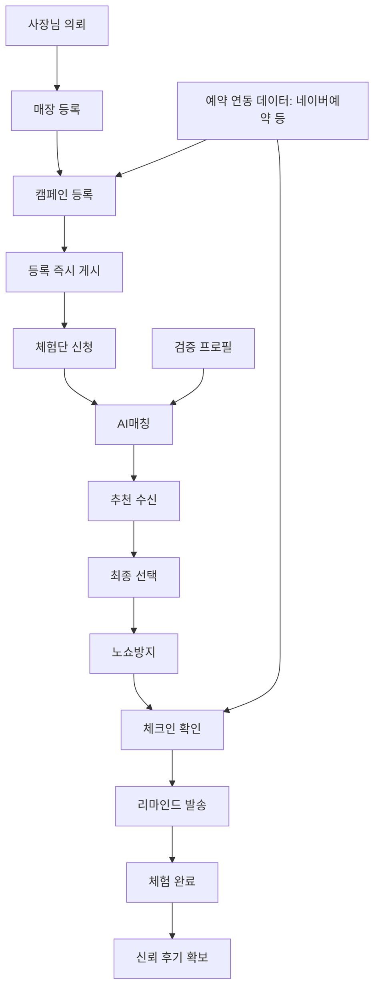
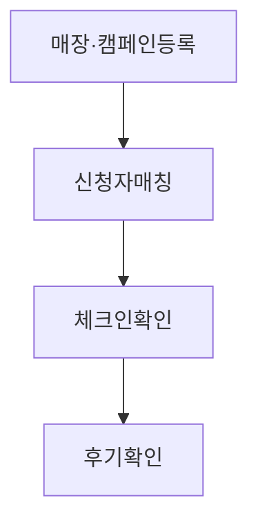
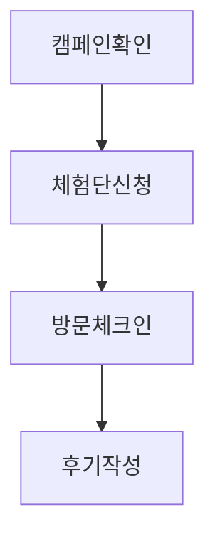

# 줄서 (Julseo) PRD

## 1. 개요 및 피벗 배경

- 프로젝트명: 줄서 (Julseo)
- 팀장: 김영란
- 팀원: 정종환, 위예은

리커리어 프로젝트에서 신규 오프라인 매장과 체험단을 연결하는 체험단 매칭 서비스로 완전히 피벗한다. 줄서는 신규 매장의 초기 방문과 후기 확보 문제를 예약 슬롯, 방문 인증, 후기 회수 흐름으로 해결하는 서비스다.

## 2. 문제정의 및 타깃고객

### 문제 정의

신규 오픈한 오프라인 매장 사장님은 빠르게 신뢰할 수 있는 방문 후기를 쌓아 초기 유입을 만드는 일을 하려는데, 노쇼와 방문 미인증, 예약 슬롯 관리의 번거로움 때문에 한산한 시간대와 부족한 후기라는 고통을 겪는다.

### 핵심 고객

- 신규 오픈 3~6개월 이내 매장 사장님
- 업종: 맛집, 카페, 액티비티
- 1차 타깃 지역: 서울 성동구(성수동), 전라도 광주, 경기 부천

## 3. 핵심가치·포지셔닝

이 사람의 초기 방문·후기 부족이라는 고통을, 예약 슬롯에 맞춰 방문이 인증된 체험단을 자동 매칭해 없애준다.

줄서는 단순 후기 모집 도구가 아니라, 한산 시간대 예약 슬롯과 방문 인증을 기준으로 체험단 방문을 실제 성사시키는 매칭 서비스다.

## 4. 핵심기능 상세

### 4.1 한산 시간대 예약 슬롯 연동 캠페인 등록

시간대 분석 → 예약연동 확인 → 슬롯 자동생성 → 체험단 노출

- 매장별 한산 시간대를 캠페인 방문 가능 시간으로 설정한다.
- 네이버예약 등 외부 예약 연동 여부를 확인한다.
- 예약 가능한 슬롯을 캠페인 단위로 자동 생성한다.
- 체험단원에게 캠페인과 방문 가능 슬롯을 노출한다.

### 4.2 QR·GPS 방문 인증(체크인)

QR 스캔 → GPS 확인 → 방문시각 검증 → 체크인 기록 저장

- 체험단원이 매장 방문 시 QR을 스캔한다.
- GPS 위치를 확인해 실제 방문 여부를 검증한다.
- 예약 슬롯과 방문 시각을 비교한다.
- 체크인 기록을 저장하고 노쇼 여부 판단에 활용한다.

### 4.3 후기 자동 회수·리마인드

체크인완료 → 후기요청 자동발송 → 마감임박 리마인드 → 제출·노쇼 판정

- 체크인 완료 후 후기 요청을 자동 발송한다.
- 후기 제출 마감이 가까워지면 리마인드를 보낸다.
- 후기 URL 제출 여부와 방문 인증 여부를 기준으로 완료 또는 노쇼를 판정한다.

## 5. 전체 프로세스

관리자 승인 심사 없음. 등록 즉시 게시한다.

## 6. 유저플로우

### 6.1 사장님 여정

### 6.2 체험단원 여정

## 7. DB 스키마

### stores

| 필드 | 설명 |
|---|---|
| id | 매장 ID |
| name | 매장명 |
| category | 매장 카테고리 |
| address | 매장 주소 |
| owner_id | 사장님 사용자 ID |
| created_at | 생성 시각 |

### campaigns

| 필드 | 설명 |
|---|---|
| id | 캠페인 ID |
| store_id | 매장 ID |
| title | 캠페인 제목 |
| visit_time_start | 방문 가능 시작 시각 |
| visit_time_end | 방문 가능 종료 시각 |
| reward_desc | 제공 혜택 설명 |
| capacity | 모집 인원 |
| apply_deadline | 신청 마감일 |
| status | 캠페인 상태 |
| created_at | 생성 시각 |

### applicants

| 필드 | 설명 |
|---|---|
| id | 신청 ID |
| campaign_id | 캠페인 ID |
| user_id | 체험단원 사용자 ID |
| region_score | 지역 적합도 점수 |
| category_score | 카테고리 적합도 점수 |
| content_score | 콘텐츠 적합도 점수 |
| total_score | 총점 |
| status | 신청 상태 |
| applied_at | 신청 시각 |

### visits

| 필드 | 설명 |
|---|---|
| id | 방문 ID |
| campaign_id | 캠페인 ID |
| applicant_id | 신청 ID |
| reservation_linked | 예약 연동 여부 |
| checkin_at | 체크인 시각 |
| checkin_method | 체크인 방식 |
| no_show | 노쇼 여부 |
| review_url | 후기 URL |
| review_confirmed_at | 후기 확인 시각 |

## 8. 수익모델

- 방문 성사 수수료: 건당 5천~1만원
- 매장 구독: 월 5~10만원

## 9. MVP 범위

| 구분 | 범위 |
|---|---|
| In | 매장 등록 |
| In | 캠페인 등록 |
| In | 규칙기반 AI매칭: 지역 40 + 카테고리 35 + 콘텐츠 25 |
| In | QR·GPS 방문 체크인 |
| In | 후기 요청 및 리마인드 |
| In | 제출·노쇼 판정 |
| Out | 승인/반려 심사 단계 |
| Out | AI매칭 고도화 |
| Out | 결제·정산 자동화 |

## 10. 디자인 시스템

(디자인 담당자 작업 완료 후 반영 예정)
